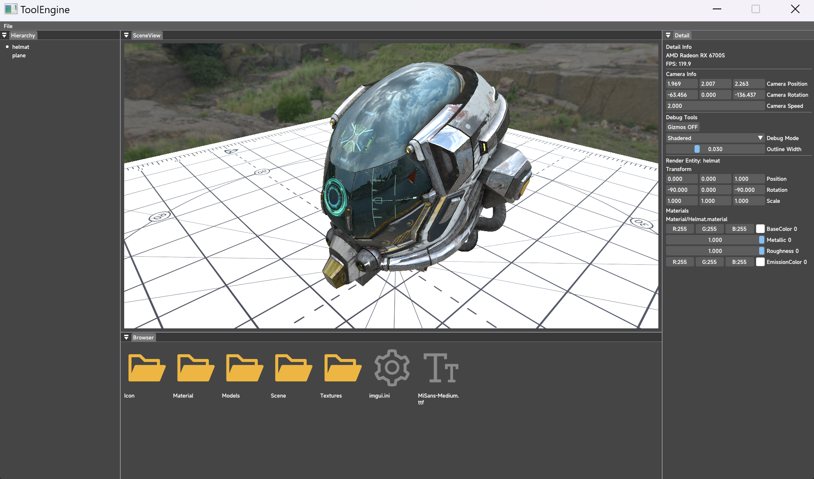

# LiteEngine

基于Vulkan的渲染器，还在锐意制作中

### 环境依赖

- Visual Studio 2022
- Vulkan

### 拉取

```bash
git clone https://github.com/Reuben-Sun/LiteEngine.git
cd LiteEngine
git submodule init
git submodule update
```


### 构建

1. 运行脚本`cmake_generate.bat`，在build文件夹中会生成VS工程
2. 用VS2022打开`.sln`工程，设置`Client`为目标，构建运行

### 开发进度

#### 2024.3.20

- 参考Unity URP重置Shader



#### 2024.3.15

- 选中物体（目前仅能在Hierarchy面板选中，后续会通过射线检测进行pickup）
- 可以选中当前调整的物体的材质参数
- 被选中物体显示描边（通过Gizmos开启），目前质量很差
- 优化Pipeline创建


#### 2024.3.8

- 绘制天空盒（但是没有做IBL）
- 清理一些Vulkan报错


#### 2024.3.3

- 使用entt重写logic scene逻辑
- 使用optick进行性能测试

#### 2024.2.28

- 添加简单光照计算
- 迭代材质系统、绑定系统
- 辅助线绘制物理BV


#### 2024.2.6

- 搭建ImGui Editor框架
- 基础Vulkan渲染
- 接入简单刚体物理系统


